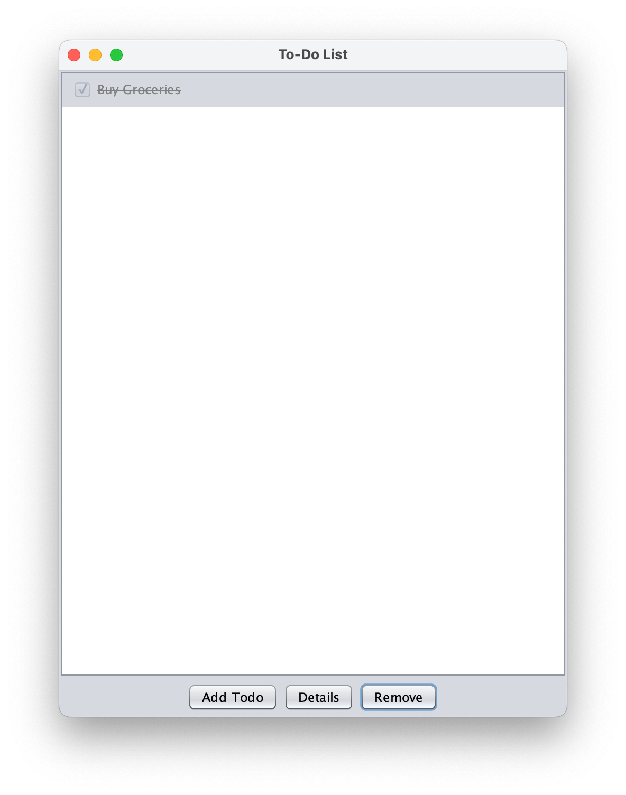

# To-Do List Application

Simple to-do list application built in Java (Swing) using the Model–View–Controller architecture.

> **Link**: [Full Guide: Model-View-Controller (MVC) in Java](https://sorn.dev/blog/full-guide-model-view-controller-mvc-in-java/)

### Component Diagram

### Use Case Diagram: New To-Do

